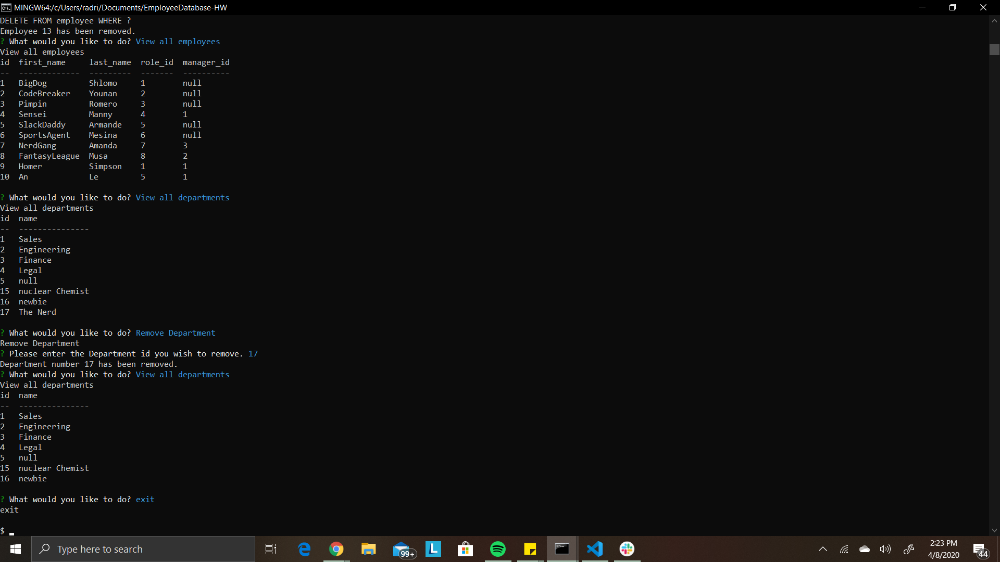

# Employee Database - Employee Tracker

## Description

The **EmployeeTracker Database** application lets the user utilize a combination of tables found in the employee database to pull information in a more user friendly way. The employee tracker database, or ***employee_db***, houses important information on every employees, such as their name, role, employee id, department they work in and their salary. The application is split into multiple functions that make a call to the database to retreive the desired information. The functions let the user:
-   View all the employees,
-   View all the managers,
-   Add an employee,
-   Add a new department,
-   Create a Role,
-   Remove an employee,
-   Remove a department,
and exit the program.

## Purpose

The main goal of this project was to practice the use of ***MySql Workbench*** and ***Node.js***. Using NodeJs allowed for a connection between the two languages as well as a direct communication using the functions of ***query connection*** and ***inquirer*** to interact with the user.

**Employee Tracker** only runs on the console, meaning this program needs the user to interact with the server directly with no front end involved.
The code for this project was made with the intention of interacting with NodeJs syntax.

## Versions

_current version:_ **1.0.0**

## Table of Contents

* [Description](#description)
* [Purpose](#purpose)
* [Versions](#versions)
* [Technologies](#technologies)
* [Usage](#usage)
* [Credits](#credits)
* [License](#license)

## Technologies:

The technologies used to create this terminal application are as follows:
- MySql Workbench
- JavaScript
- Node.js
- Node Package Manager
- GitHub
- GitBash terminal
- Google (...lots)

## Usage 

**Employee Tracker** will only run when opened on a terminal.
Examples show on the README.md were executed using GitBash app terminal.

1. Open the Terminal and navigate to the folder containing the application.

2. Run the server.js file to begin the application.

3. The app will prompt you a question _"What would you like to do?"_ followed by a list of commands
    This is the commands you will be able to choose from:
      * View all the employees
      * View all the managers
      * Add an employee
      * Add a new department
      * Create a Role
      * Remove an employee
      * Remove a department
      * Exit
    Navigate through these options using the arrow keys on your keyboard and activate them by pressing enter.

4. The function of choice will then run. The _View_ options will present a table with the stated information. The _Add, Creat,_ and _Remove_ functions will prompt some necessary information needed to complete the function. And the _Exit_ function will terminate the application.

### Demo of Application

Take a look at this gif to see how the Employee Tracker database application works.

... _video may be small...please zoom in or check this mp4 version_ ...
[EmployeeTrackermp4](https://drive.google.com/file/d/15M-G4gBlqd59HKUeG0npeK4PsMZPLo-z/view)

[Adrian'sGithub](https://github.com/adrianromero13)

## Credits

* Collaborators:    
    - **[Adrianromero13](http://github.com/adrianromero13)**
    - **[Armande925](http://github.com/armande925)**
    - **[Markmesina](https://github.com/markmesina)**
    - **[Markyounan11](https://github.com/markyounan11)**

* UC Berkeley, Extensions Full Stack Development BootCamp Instructors & Assistants
    - Manny Jucaban
    - Musa Akbari
    - Amanda Crawford

* Google inc.           **[Google](https://www.google.com)**
* NPM Registry          **[NMP](https://docs.npmjs.com/)**
* Inquirer NPM          **[Inquirer](https://www.npmjs.com/package/inquirer)**
* GitHub                **[GitHub](https://github.com/)**
    
    

## License

[GNU General Public License v3.0](./LICENSE.txt)

## Contributing

[Contributor Covenant](https://www.contributor-covenant.org/)

---
Adrian Romero 2020 EmployeeTracker Assignment

